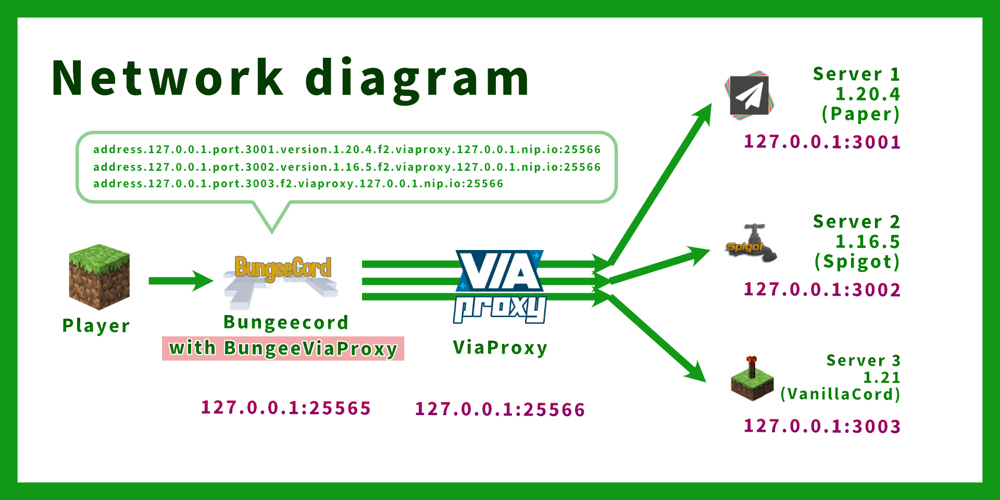

# BungeeViaProxy

## Overview

**BungeeViaProxy** is a BungeeCord plugin designed to address compatibility issues when using [ViaProxy](https://github.com/ViaVersion/ViaProxy) with [BungeeCord](https://github.com/SpigotMC/BungeeCord).  
This plugin is especially useful for networks with multiple backend servers running different Minecraft versions, where you want to minimize the overhead of maintaining ViaVersion plugins on each backend server.

ViaBungee support was discontinued as of Minecraft 1.20.2, making it necessary to migrate to ViaProxy for compatibility with newer versions of the game.  
This guide is valuable for those who wish to continue using BungeeCord with the latest Minecraft versions while avoiding the burden of individually updating ViaVersion on each backend server.  

By leveraging ViaProxy with wildcard-domain-handling, a single ViaProxy instance can support multiple backend servers, simplifying updates and reducing resource usage.

## Table of Contents
- [Use Case](#use-case)
- [How It Works](#how-it-works)
- [Features](#features)
- [Installation](#installation)
- [Configuration](#configuration)
- [Example Configuration](#example-configuration)

## Use Case

BungeeViaProxy is ideal for:

- Networks using BungeeCord to manage multiple backend servers running different Minecraft versions.
- Administrators who want to maintain compatibility with the latest Minecraft versions using ViaProxy and Bungeecord.
- Reducing the operational overhead of updating ViaVersion plugins on individual backend servers by centralizing version translation via ViaProxy.

**Important:** When using ViaProxy in such a setup, it must be placed between BungeeCord and the backend servers. Additionally, in ViaProxy's configuration:

- `proxy-online-mode` must be disabled.
- `auth-method` must be set to `NONE`.
- `wildcard-domain-handling` must be set to `PUBLIC`.
- `target-address` is ignored (anything is OK) while using `wildcard-domain-handling`.

## How It Works

Normally, each backend server would require a separate ViaProxy instance.  
However, this can lead to increased memory consumption and additional update efforts.  

To address this, ViaProxy supports the `wildcard-domain-handling` feature, allowing a single ViaProxy instance to handle connections to multiple backend servers.  
This is achieved by using a specific address format for each backend server:

```
address.<backend-ip>.port.<backend-port>.version.<backend-version>.viaproxy.<viaproxy-ip>.nip.io:<viaproxy-port>
```

These addresses can then be listed in the `config.yml` of BungeeCord, enabling seamless connection management through a single ViaProxy instance.  
However, this setup introduces certain challenges, which BungeeViaProxy resolves.

## Features

1. **Correct Hostname Forwarding:**
   When `wildcard-domain-handling: PUBLIC` is enabled in ViaProxy, it may fail to retrieve the hostname specified in BungeeCord's configuration, preventing proper server routing. BungeeViaProxy ensures that any address containing `.viaproxy.` is forwarded correctly to the backend server.

2. **Avoiding Duplicate Server Errors:**
   BungeeCord treats servers with different hostnames as identical if they resolve to the same IP address, resulting in the error: `You are already connected to this server!`. BungeeViaProxy resolves this by using unresolved `InetSocketAddress` objects, ensuring unique identification for servers with different hostnames.

## Installation

1. Download the latest release of BungeeViaProxy.
2. Place the plugin `.jar` file into your BungeeCord `plugins` directory.
3. Restart your BungeeCord server.

## Configuration

No additional configuration is required. BungeeViaProxy automatically handles `.viaproxy.` addresses and ensures proper server routing.

## Example Configuration



Here is an example of how to configure BungeeCord to work with ViaProxy using wildcard-domain-handling

Assuming the following setup:
| Server           | IP:Port             | Minecraft Version |
|------------------|---------------------|-------------------|
| BungeeCord       | 127.0.0.1:25565     | N/A               |
| ViaProxy         | 127.0.0.1:25566     | N/A               |
| Backend Server 1 | 127.0.0.1:3001      | 1.20.4            |
| Backend Server 2 | 127.0.0.1:3002      | 1.16.5            |
| Backend Server 3 | 127.0.0.1:3003      | 1.21              |

BungeeCord `config.yml` (only relevant options are shown):
```yaml
online_mode: true
servers:
  server1:
    # ViaProxy address format: address.<backend-ip>.port.<backend-port>.version.<backend-version>.viaproxy.<viaproxy-ip>.nip.io:<viaproxy-port>
    address: address.127.0.0.1.port.3001.version.1.20.4.viaproxy.127.0.0.1.nip.io:25566
    motd: '&1Example Server 1'
    restricted: false
  server2:
    # In this example,
    # Backend server IP: 127.0.0.1:25566
    # ViaProxy IP: 127.0.0.1:3002
    address: address.127.0.0.1.port.3002.version.1.16.5.viaproxy.127.0.0.1.nip.io:25566
    motd: '&1Example Server 1'
    restricted: false
  server3:
    # Version can be omitted if not needed (version is automatically detected by ViaProxy)
    address: address.127.0.0.1.port.3003.viaproxy.127.0.0.1.nip.io:25566
    motd: '&1Example Server 3 (".version.1.20.4" can be omitted)'
    restricted: false
listeners:
- host: 0.0.0.0:25565
prevent_proxy_connections: false
ip_forward: true
```

ViaProxy `config.yml` (only relevant options are shown):
```yaml
# ViaProxy configuration file

# The address ViaProxy should listen for connections.
# This option is not reloadable.
bind-address: 0.0.0.0:25566

# The address of the server ViaProxy should connect to.
target-address: AnythingIsOK.ThisFieldIsIgnored.example.com

# Proxy Online Mode allows you to see skins on online mode servers and use the signed chat features.
# Enabling Proxy Online Mode requires your client to have a valid minecraft account.
proxy-online-mode: false

# The authentication method to use for joining the target server.
# none: No authentication (Offline mode)
# openauthmod: Requires the OpenAuthMod client mod (https://modrinth.com/mod/openauthmod)
# account: Use an account for joining the target server. (Has to be configured in ViaProxy GUI)
auth-method: NONE

# Allows clients to specify a target server and version using wildcard domains.
# none: No wildcard domain handling.
# public: Public wildcard domain handling. Intended for usage by external clients. (Example: address.<address>.port.<port>.version.<version>.viaproxy.127.0.0.1.nip.io (version is optional))
# internal: Internal wildcard domain handling. Intended for local usage by custom clients. (Example: original-handshake-address\7address:port\7version\7classic-mppass)
wildcard-domain-handling: PUBLIC
```

Backend Server `server.properties` (only relevant options are shown):
```properties
server-port=3001
online-mode=false
```

Backend Server `spigot.yml` (only relevant options are shown):
```yaml
settings:
  bungeecord: true
```

Note:
- No ViaVersion plugin is required on the backend servers. (Because version translation is handled by ViaProxy)
- Do not use [ViaProxyAuthHook](https://github.com/ViaVersionAddons/ViaProxyAuthHook) as ViaProxy is placed between BungeeCord and the backend servers.

## License

BungeeViaProxy is open-source and licensed under the MIT License. Contributions and feedback are welcome.

